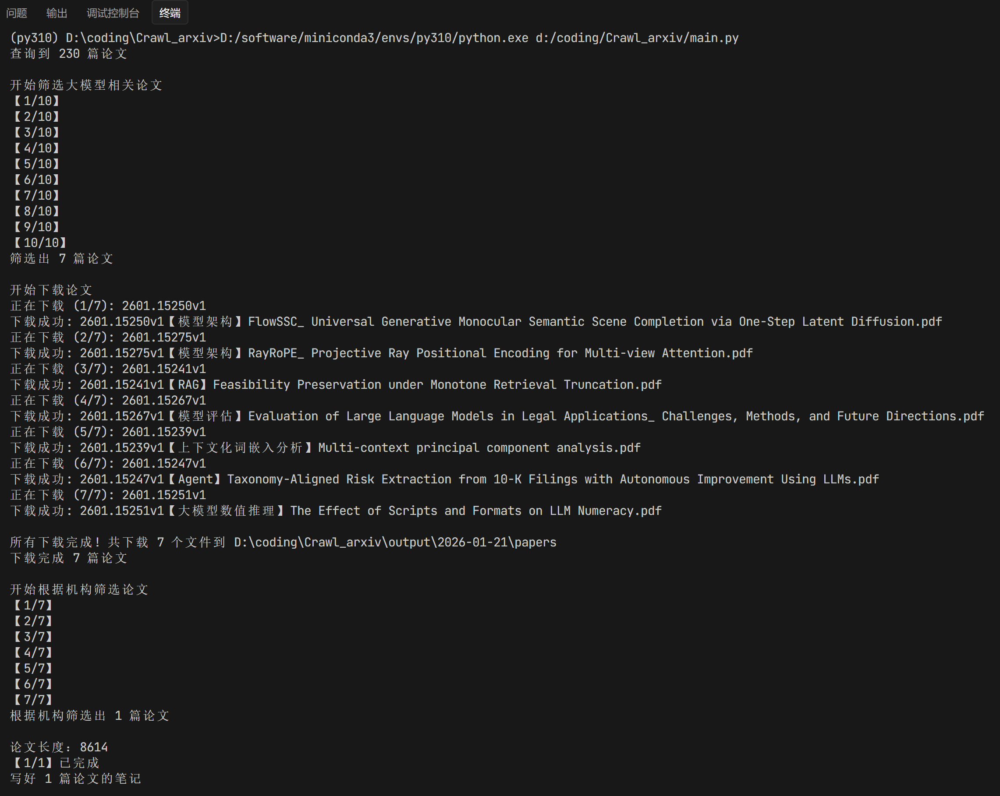
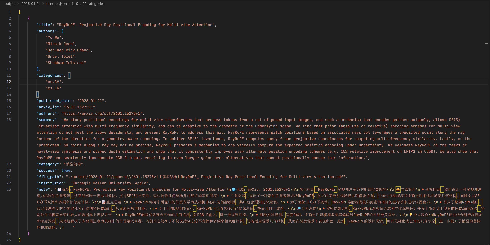
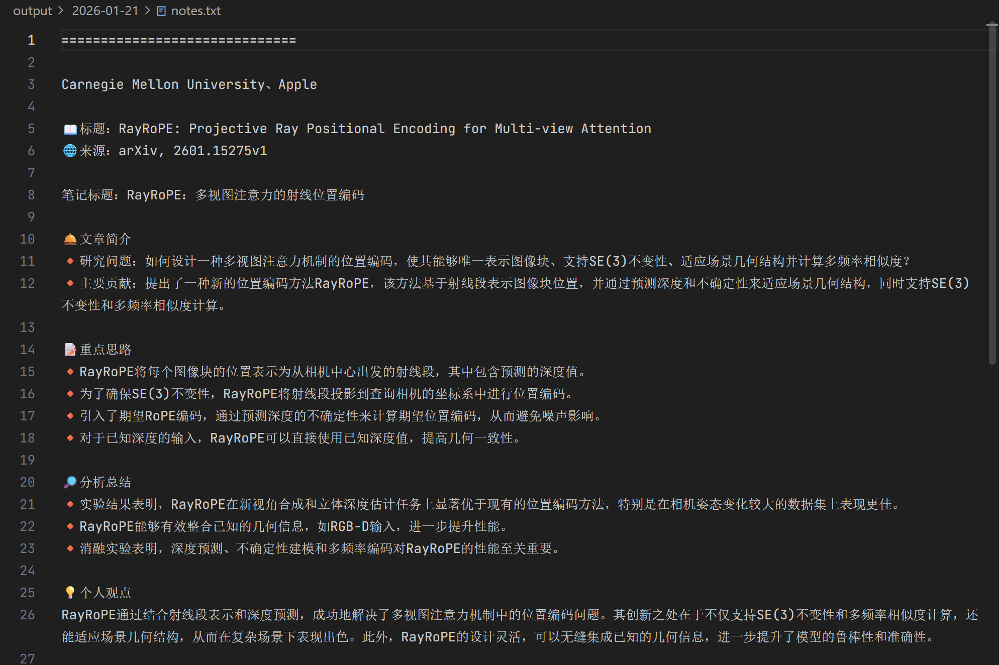

# Crawl_arxiv

一个轻量级的arXiv论文批量下载工具，支持按分类、日期、主题和机构抓取，并按照要求进行论文解读。
<div align="center">

   

</div>

## 更新日志
- **2026-02-18**：
  - 优化主题筛选：更新了`filter_paper.py`中的提示词，优化论文标签；
  - 新增机构分类：更新了`institution.py`、`filter_institution.py`，划分为“国外工业界”、“国内工业界”、“国外学术界”、“国内学术界”、“其他”；
  - 新增笔记分类：更新了`write_note.py`、`main.py`，按照机构分类拆分笔记，方便分类阅读。
- **2026-02-16**：
  - 优化主题筛选：更新了`filter_paper.py`中的提示词，让大模型尽可能根据论文主要创新点来命名；
  - 优化论文命名：新增`filter_institution.py`中的重命名逻辑，根据机构筛选结果，重命名为`{arxiv_id}【{category}-{institution}】{title}`，如`2602.10410v1【高效注意力机制-谷歌】LUCID_ Attention with Preconditioned Representations`；
- **2026-02-08**：
  - 优化中断处理：对于`main.py`脚本在机构筛选执行中断后，重新运行会跳过已处理的文章；

## 1 背景简介
- 个人工作需求和业余知识博主爱好，需要追踪大模型的最新研究动态，将最新的研究方向和算法方案，形成笔记分享给读者。
- 原先的流程是去一些论坛如智源社区，打开论文板块根据摘要来初筛感兴趣的内容，再点开论文看机构权威性，筛选的过程太过耗时。
- 为了提高效率，开发了这个工具，支持根据发表日期和文章主题来批量下载arXiv上的论文，并自动打上类别标签和解读。
- 欢迎关注我的小红书 [大模型任我行](https://xhslink.com/m/4ZdZlE5BWqG)，每日论文分享~

## 2 快速上手

### 2.1 项目主要结构
```markdown
. 📂 Crawl_arxiv
├── 📄 main.py # 运行脚本
├── 📄 LICENSE
├── 📄 README.md
└── 📂 config/
│  ├── 📄 __init__.py
│  ├── 📄 LLM_Client.py # 大模型接口调用配置
│  ├── 📄 institution.py # 关注的机构清单
└── 📂 tools/
│  ├── 📄 __init__
│  ├── 📄 find_paper.py # 查找论文
│  ├── 📄 filter_paper.py # 筛选大模型论文
│  ├── 📄 download_paper.py # 下载论文
│  ├── 📄 filter_institution.py # 筛选关注机构论文
│  └── 📄 write_note.py # 生成笔记
└── 📂 output/ # 输出目录，每个日期一个文件夹
│  └── 📂 2026-01-21/
│    ├── 📄 papers.json # 原始论文清单
│    ├── 📄 papers_filter.json # 大模型相关论文清单
│    ├── 📄 downloaded.json  # 论文下载路径清单
│    ├── 📄 filter_institution.json # 机构筛选后清单
│    ├── 📄 notes.json # 大模型解读清单
│    ├── 📄 notes.txt # 大模型解读笔记
│    └── 📂 papers/ # 下载的论文目录
```
### 2.2 运行步骤
1. **修改大模型调用（必须）**：在```config/LLM_Client.py```中，填入大模型接口地址和密钥。
2. **修改关注的机构（可选）**：在```config/institution.py```中，填入关注的机构及论文名称清单。
3. **运行主脚本**（必须）：在项目根目录下运行```python main.py --date 2026-01-21```。

### 2.3 运行样例
#### 运行主脚本
日期为2026-01-21，只保留10篇大模型相关，执行下载、机构筛选和解读过程。
<div align="center">
  
</div>

#### 结构化输出
<div align="center">
  
</div>

#### 便捷查看笔记
<div align="center">
  
</div>

## 3 主要模块
### 3.1 查找论文
代码在 ```tools/find_paper.py``` ，根据日期和分类，从arXiv上查找符合条件的论文。
- 核心在于生成arxiv的查询语句，形如```(cat:cs.CL OR cat:cs.AI OR cat:cs.LG OR cat:cs.IR OR cat:cs.CV) AND (submittedDate:[202601200000 TO 202601210000])```，表示查找2026年1月20日0点-2026年1月21日0点发布的分类为cs.CL、cs.AI、cs.LG、cs.IR、cs.CV的论文。
- 输出在```output/日期/papers.json```，每个论文包含```arxiv_id```、```title```、```summary```等信息。

### 3.2 筛选大模型论文
代码在 ```tools/filter_paper.py``` ，根据论文标题+摘要，筛选出与大模型相关的论文。
- 筛选建议：关键词容易罗列不全导致遗漏，建议还是直接让大模型自己判断。标题和摘要加起来一般是500字以内消耗不大，因为论文有很多新概念，建议用思考模型才能理解的比较好，如```qwen-plus```。
- 提示词样例：
   ```
   给定如下信息：
   标题：{title}
   摘要：{summary}
   请根据论文的标题和摘要，判断这篇论文是否和大模型相关
   ```
- 输出在 ```output/日期/papers_filter.json``` ，新增一个 ```category``` 字段。

### 3.3 下载论文
代码在 ```tools/download_paper.py``` ，根据筛选结果，下载符合条件的论文。
- 我们的目标是选出关注机构的论文，机构信息不在arxiv元数据中，因此需要把论文下载好提取。
- 核心是做好文件路径管理，我这里文件名是```arxiv_id```+```category```+```title```，形如```2601.15251v1【大模型数值推理】The Effect of Scripts and Formats on LLM Numeracy.pdf```；
- 下载时添加间隔，避免对服务器造成压力被封；
- 输出在 ```output/你的日期/downloaded.json``` ，新增一个 ```file_path``` 字段。

### 3.4 筛选关注机构论文
代码在 ```tools/filter_institution.py``` ，根据配置的机构清单 ```config/institution.py``` ，筛选出在关注机构清单中的论文并对论文重命名。
- 解析建议：机构名称一般在论文第一页上方，少部分在第一页下方脚注，因此只需要文字解析第一页即可。
- 筛选建议：考虑到机构名称有时候难以罗列全，建议也是让大模型自行提取判断。第一页一般是1000字以内消耗不大，清单列全一点只要非思考模型即可，如```qwen2.5-72b-instruct```。
- 提示词如下：
   ```
   prompt = f"""
   请从以下论文的第一页中判断论文是否属于我关注的机构，如果是则返回论文全部的机构名称（顿号间隔），否则返回无。不需要返回其他内容。
   第一页内容：{first_page}
   我关注的机构及在论文中的名称：{institution}
   """
   ```
- 输出在```output/你的日期/filter_institution.json```，多一个```institution```字段。

### 3.5 生成笔记
代码在```tools/write_note.py```，解析全文生成笔记。
- 提示词样例（**请自行修改为你喜欢的格式**）：
   ```
    你是一个论文笔记助手，请阅读论文内容，严格按照格式写这篇论文的笔记，不要带有markdown格式，字数控制在900字以内。格式如下：笔记标题：（中文短句说明论文的贡献）\n\n🟦文章简介\n研究问题：（论文试图解决什么问题）\n主要贡献：（论文有什么贡献）\n\n🟦重点思路 （逐条写论文的研究方法是什么，以🔺作为开头）\n\n🟦分析总结 （逐条写论文通过实验分析得到了哪些结论，以🔺作为开头）
   ```
- 笔记输出：在 ```output/你的日期/notes.json``` 文件，新增```note```字段。
- 笔记阅读：在 ```output/你的日期/notes.txt``` 文件，方便查看。
